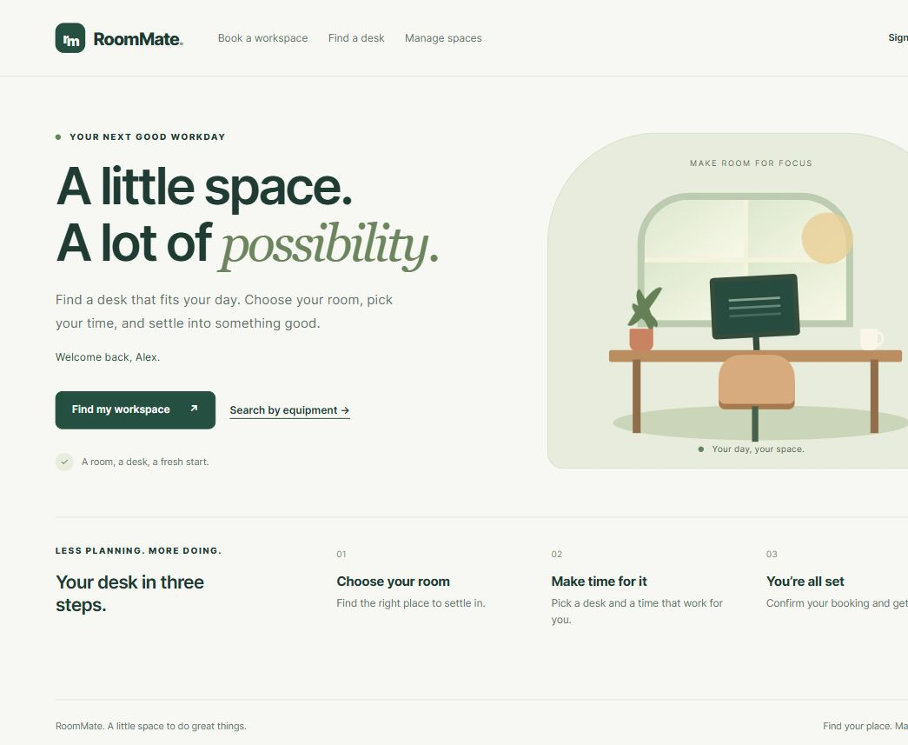

# RoomMate

A workspace reservation application built with **Java 21, Spring Boot,
Thymeleaf and PostgreSQL**. Find a room, choose a desk, and reserve a time slot.

This project began as collaborative university coursework and is being
revisited for hands-on Java, OOP, Spring and testing practice. It is a work in
progress, with its current limitations documented rather than hidden.



## What you can do

- Browse rooms and book workspaces for a chosen date and time.
- Search available desks, optionally filtering for HDMI and USB-C equipment.
- Sign in through GitHub OAuth and keep access to administration role-based.
- Manage rooms, workspaces, equipment and reservations as an administrator.
- Receive field-level booking errors and overlap feedback.
- Optionally synchronize rooms and keys from an external KeyMaster service.

All pages use a shared responsive layout with locally served styles and scripts.
The screenshot uses sample data; a new installation starts with an empty database.

## Technology

| Area | Technology in this repository |
| --- | --- |
| Language | Java 21 |
| Framework | Spring Boot 3.2.1 |
| Web interface | Spring MVC and Thymeleaf |
| Authentication | Spring Security and GitHub OAuth 2.0 |
| Persistence | Spring Data JDBC and PostgreSQL 15 |
| Database migrations | Flyway |
| Local infrastructure | Docker Compose for PostgreSQL |
| Tests | JUnit 5, Mockito, AssertJ, MockMvc and H2 |
| Build | Gradle wrapper 8.5 |

The application uses JDBC, not JPA/Hibernate. WebClient is used for the
KeyMaster integration; browser routes use Spring MVC.

## Quick start

Install JDK 21 and Docker with Compose. Register a GitHub OAuth application
with homepage `http://localhost:8080` and callback
`http://localhost:8080/login/oauth2/code/github`.

In PowerShell, set the configuration for this terminal session:

```powershell
$env:CLIENT_ID = "your-github-oauth-client-id"
$env:CLIENT_SECRET = "your-github-oauth-client-secret"
$env:ROOMMATE_ADMINS = "your-github-username"
$env:KEYMASTER_ENABLED = "false"
docker compose up -d
.\gradlew.bat bootRun
```

On macOS/Linux:

```bash
export CLIENT_ID="your-github-oauth-client-id"
export CLIENT_SECRET="your-github-oauth-client-secret"
export ROOMMATE_ADMINS="your-github-username"
export KEYMASTER_ENABLED=false
docker compose up -d
bash gradlew bootRun
```

Open [RoomMate locally](http://localhost:8080), sign in, and use **Manage spaces**
to add a room, desk and equipment. The admin username must match your GitHub login.

The supplied database username/password are local-development examples.
Spring does **not** load `.env` automatically: export variables as above or
configure your IDE. See [setup and troubleshooting](docs/SETUP.md) for details.

## Run the tests

```powershell
.\gradlew.bat test
```

```bash
bash gradlew test
```

Tests run without PostgreSQL, Docker, real OAuth credentials or KeyMaster.
The latest local run passed **61 tests**. Database integration tests use H2;
they do not establish PostgreSQL compatibility or prove real GitHub login.

The GitHub Actions workflow is configured to run the suite on pushes and pull
requests. Its first remote run will be verified after publication.

## Documentation

| Guide | Contents |
| --- | --- |
| [Setup](docs/SETUP.md) | Requirements, OAuth, environment variables, Docker and troubleshooting |
| [Architecture](docs/ARCHITECTURE.md) | Layers, request flow, dependencies and frontend structure |
| [Routes](docs/ROUTES.md) | User routes, administration and the KeyMaster endpoint |
| [Database](docs/DATABASE.md) | Tables, migrations and reservation overlap rules |
| [Testing](docs/TESTING.md) | Test scopes, coverage, commands and preview artifacts |
| [Roadmap](docs/ROADMAP.md) | Known limitations and next development steps |
| [Contributing](CONTRIBUTING.md) | Local development and review expectations |
| [Security](SECURITY.md) | Credentials, test data and deployment boundaries |

## Project structure

```text
src/main/java/example/roommate/
  Web/                     Controllers, form binding and security
  Application/Service/     Application operations and integration services
  Domain/model/            Rooms, workspaces, equipment and reservations
  DataBase/                Spring Data JDBC repositories and DTO mapping
src/main/resources/
  templates/               Thymeleaf pages and shared fragments
  static/css/              Shared frontend styles
  static/js/               Browser validation and deletion confirmations
  db/migration/            Versioned Flyway migrations
src/test/                  Unit, controller and database integration tests
docs/                      Project documentation and screenshot
```

## Status and attribution

This is a learning and portfolio project, not a production booking service.
Concurrent booking protection, ownership-based reservations, dependency updates
and PostgreSQL-specific verification remain future work. See the roadmap.

The original project was a team effort; the current version includes subsequent
refactoring and interface improvements. No open-source license has been selected
for the application yet. Preserve contributor attribution and establish the
appropriate permissions before redistributing or relicensing the coursework.
