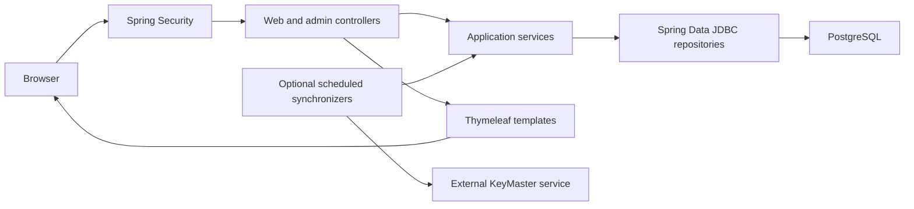

# Architecture

RoomMate is a server-rendered Spring MVC application with Spring Data JDBC.
Java objects carry reservation data, services coordinate application operations,
and repositories handle database access.

## Layers

| Package | Responsibility |
| --- | --- |
| `Web` | Routes, form binding, model attributes, validation feedback and security |
| `Application.Service` | Room, workspace, person, key and reservation operations |
| `Domain.model` | Entity data, constructors, getters, setters and identity |
| `DataBase` | Repository interfaces, SQL queries and persistence mapping |

`RoomRepository` is an application-facing interface. `RoomRepositoryImpl`
adapts it to `RoomDAO` and maps `Room` to/from `RoomDto`. Other services
currently depend directly on Spring Data repository interfaces, so the layering
is useful but not yet uniform.

Constructor injection makes required dependencies explicit. Spring creates
beans for the application, while unit tests instantiate the same services with
mock dependencies. Domain models still contain persistence/validation annotations;
this is not a strict framework-independent domain architecture.

## Booking request

1. `GET /chooseplatz/{roomId}` loads desks and a model object named `reservation`.
2. The browser submits workspace ID, date and times to `POST /chooseplatz`.
3. `@ModelAttribute("reservation")` binds fields; `@Valid` evaluates constraints.
4. Binding errors return the form before custom time comparisons run.
5. Custom validation checks ordering and past starts; the chosen desk is checked
   against the selected room.
6. The repository query checks existing overlapping reservations.
7. `saveReservation` also rejects missing or non-increasing times before saving.
8. A successful POST redirects to `GET /confirm` (Post/Redirect/Get).

Validation feedback lives in the controller's `BindingResult`. The save guard
protects time ordering for other service callers too, but date validation and
overlap checks are not yet enforced atomically in one save operation.

## Search

`WantedPeriod` binds `date`, `timeFrom` and `timeTo`. Search finds desks without
overlapping bookings, then optionally filters for all requested equipment names.
Result links pass `arbeitsplatzId`, `tag`, `startTime` and `endTime` into the
booking form so the selected details are preserved.

## Authentication and authorization

- GitHub OAuth identifies users; `PersonService` records GitHub identity on home visits.
- The OAuth user service grants `ROLE_USER` and optionally `ROLE_ADMIN` from configured logins.
- `@OnlyAdmin` protects administration using method security.
- Navigation uses Thymeleaf's Spring Security integration to hide admin links
  from ordinary users; backend authorization remains the enforcement point.
- POST forms keep CSRF protection. Logout is also submitted as a POST.
- `/api/access` is currently public; audit it before any hosted deployment.

## Frontend

`templates/fragments/layout.html` contains the shared head, navigation and footer.
`static/css/roommate.css` supplies typography, colors, room cards, form layouts,
tables and responsive breakpoints. `static/js/roommate.js` adds time-range
feedback and destructive-action confirmation. Server validation remains necessary
when JavaScript is bypassed.

Styles/scripts are local. The rendered preview files are test artifacts, not
a separate single-page application or a live booking backend.

## KeyMaster

Conditional synchronizer beans use WebClient to poll external room and key
collections. The normal web interface remains MVC despite the WebFlux client
dependency. KeyMaster transport, retries and UUID lookup consistency are listed
as unfinished integration work in the roadmap.
